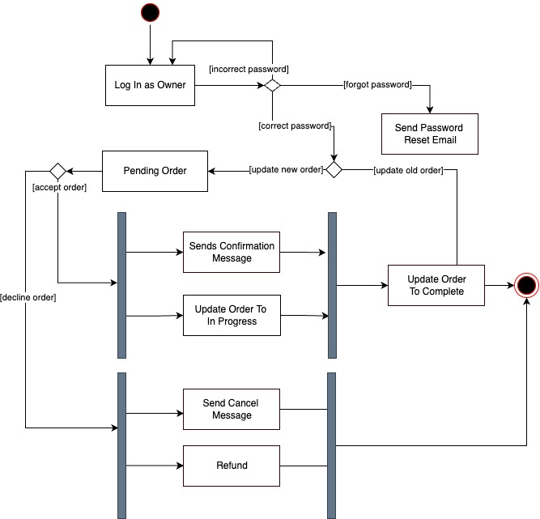

# Specification Phase Exercise

A little exercise to get started with the specification phase of the software development lifecycle. See the [instructions](instructions.md) for more detail.

## Team members

Seok Tae Kim - https://github.com/seoktaekim
See instructions. Delete this line and replace with a list of the names of your team members, including links to each one's GitHub profile.

## Stakeholders

See instructions. Delete this line and replace with the name(s) of the stakeholder(s) you interviewed and lists showing their goals/needs, and problems/frustrations.

## Product Vision Statement

Our app is a user-friendly platform that serves to provide mobile food vendors and customers with the ability to pre-order food to reduce wait-time, help spread awareness of food trucks’ locations and products, and allow the use of online paying services for purchases.

## User Requirements

1. As a customer, I want to get preorder my food at a specific time slot so that I could be more productive with my time.
2. As a customer, I want to pay electronically so that I do not have to get cash.
3. As a customer, I want to see all available food trucks in my area so that I can go to the nearest one.
4. As a customer, I want to log in so that I can check my preorder time.

## Activity Diagrams

- As a mobile food vendor, I want to view the current pending orders from my customers so that I can serve them.

## Prototype Link
[Prototype](https://www.figma.com/file/bFibhPH28vJeO0e7Wsk4J6/Food-Truck-Order-App?node-id=0%3A1)